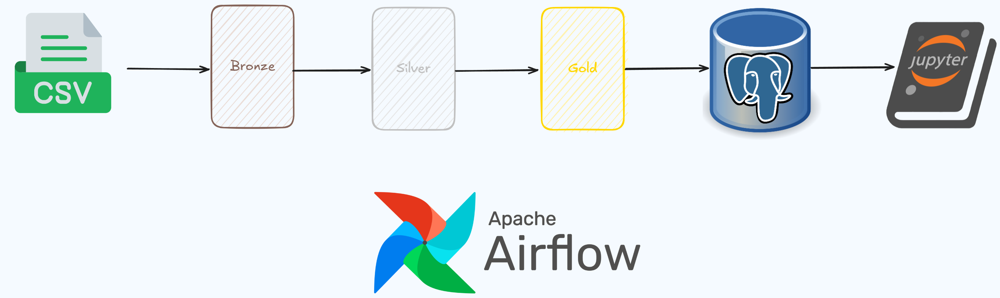
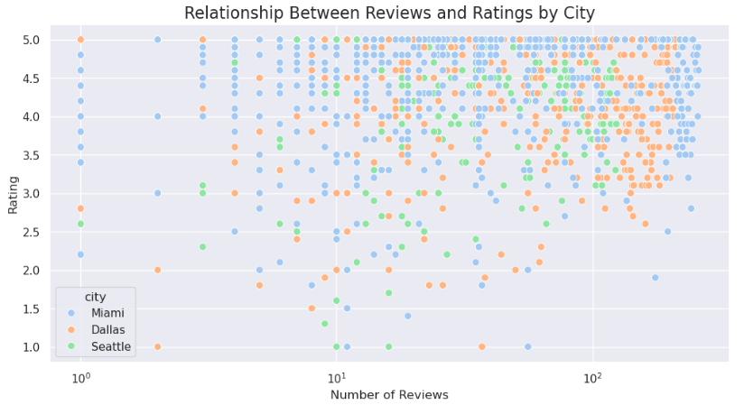

# Clever Data Engineer Trial Project

## Project Description

This project simulates a production-grade **Lakehouse architecture**, orchestrated with **Apache Airflow**, to ingest, clean, validate, transform, and analyze data related to moving companies in the U.S. The data flows through the canonical **Bronze → Silver → Gold** layers and is ultimately stored in `.parquet` format and a **PostgreSQL** database, fully prepared for analytical use.

---

## Architecture Layers

The pipeline follows a Lakehouse approach:

- **Bronze**: Raw CSV files in their original structure, organized by entity and ingestion date (`data/BRONZE/{entity}/{date}/file.csv`).
- **Silver**: Cleaned and validated data. It handles malformed rows, removes duplicates and nulls, enforces typing, and applies data quality checks. Output is stored as `.parquet` files.
- **Gold**: Joined and curated datasets enriched with business logic. Stored in **PostgreSQL** tables, with UPSERT logic using a control field `updated_at`.


---

## Key Features

### 1. Modular Architecture (Python)

The codebase under `dags/scripts/` is organized by layer:

- `bronze/main.py`: Loads raw `.csv` files, performs structural validations, and prepares them for transformation.
- `silver/main.py`: Applies transformations, type casting, null/duplicate handling, and validates data using Great Expectations.
- `gold/main.py`: Joins and enriches entities to generate the final datasets:
  - `google_agents_data`
  - `fmcsa_companies_data`
- `database_operations/postgres_helper.py`: Contains functions to connect, create or overwrite PostgreSQL tables, and perform UPSERT logic.

### 2. Data Quality with Great Expectations

The `validations.py` module defines entity-specific validations, including:

- Uniqueness constraints (`google_id`, `usdot_num`)
- Column type validation
- Null percentage threshold enforcement

### 3. UPSERT and Freshness Control

Each file processed is evaluated based on its **modification timestamp**:

- The system only processes the most recent files per entity
- PostgreSQL inserts or updates records based on the `updated_at` field, ensuring freshness and avoiding unnecessary overwrites

### 4. Full Airflow Orchestration

Main DAG: `clever_main_DAG.py`

- Triggers Bronze → Silver → Gold processing in sequence
- Ends by uploading curated data to PostgreSQL
- Modular, reusable, and ready for daily/weekly execution in production

---

## How to Run the Project

### Prerequisites

- Docker & Docker Compose
- Git installed

### Steps

1. Clone the repository:
   ```bash
   git clone https://github.com/your-username/clever-real-state-project.git
   cd clever-real-state-project
2. Start the project with Docker Compose:
```bash
docker-compose up --build
```

3. Access the services:

   - **Airflow**: [http://localhost:8080](http://localhost:8080)  
     *Username*: `airflow` | *Password*: `airflow`

   - **PgAdmin**: [http://localhost:8081](http://localhost:8081)  
     *Connection Info*:
     - Host: `postgres_clever`  
     - User: `clever`  
     - Password: `clever`

   - **JupyterLab**: [http://localhost:8888](http://localhost:8888)

4. Open Airflow, activate and trigger the DAG named `clever_main_DAG`.

5. Output locations:

   - Cleaned files: `data/SILVER/{entity}/{date}.parquet`
   - Curated data in PostgreSQL:
     - `gold_google_agents_data`
     - `gold_fmcsa_companies_data`

6. Use the notebooks inside the `notebooks/` folder to explore and analyze the data.

---

## Data Analysis


The notebook is available at: 🔗 [View the notebook on GitHub](https://github.com/ricmotta/data-trial/blob/main/notebooks/real_state_analysis.ipynb)

The goal of this analysis is to extract meaningful insights from the curated `gold_google_agents_data` dataset stored in PostgreSQL. Using Python (Pandas, Seaborn, Matplotlib and TextBlob), the notebook explores:

- **Geographical trends** in agent distribution and satisfaction
- **Performance score ranking** of agents based on ratings, reviews, and photo engagement
- **Sentiment classification** of customer reviews (positive, neutral, negative)
- **City-by-city comparisons** of rating distributions and agent behavior
- **Heatmaps and visual dashboards** to reveal high-activity zones in the U.S.

This notebook showcases how a well-structured data pipeline can support actionable business intelligence and localized content strategies in the real estate industry.

---

## Project Structure

```text
dags/
├── scripts/
│   ├── bronze/
│   │   └── main.py
│   ├── silver/
│   │   └── main.py
│   ├── gold/
│   │   └── main.py
│   ├── database_operations/
│   │   └── postgres_helper.py
│   └── utils/
│       └── (common helpers and validations)
├── clever_main_DAG.py
├── data/
├── docs/
├── notebooks/
├── requirements.txt
└── docker-compose.yaml
```

## Key Features and Benefits

- **Modular, layered architecture**: Clear separation of responsibilities by processing stage (Bronze, Silver, Gold)
- **Automated data validation**: With `Great Expectations`, ensuring schema consistency and quality
- **Freshness-aware UPSERT**: Only newer data is inserted or updated, preventing data drift
- **PostgreSQL integration**: Final data is stored in SQL tables, ready for BI and reporting
- **Sentiment analysis** on review data using NLP
- **Production-oriented orchestration**: Airflow DAG handles the full pipeline with logs and retries

---

## Improvement Possibilities

- **PySpark integration** for large-scale data handling
- **Delta Lake support** for versioning and historical data snapshots
- **Cloud storage (S3) support** to replace local file system simulation
- **Column-level lineage and audit logging**
- **Integration with real-time data ingestion** using Airflow sensors or event-based triggers

---

## Project Purpose and Impact

Transform fragmented and inconsistent raw data about real estate agents and moving companies into a robust, trusted, and analytics-ready data infrastructure using a Lakehouse approach.

The pipeline enables:

- **Location-based insights** into agent performance and customer satisfaction across cities and states.
- **Data-driven ranking** of agents and agencies based on key performance indicators (ratings, reviews, photo engagement).
- **Sentiment analysis** of customer reviews to uncover trends in satisfaction and service quality.
- **Identification of top-performing agents**, underperformers, and improvement opportunities.
- **Personalized content generation** for real estate consumers and stakeholders based on geographical and performance-related factors.

This architecture empowers teams to make informed, localized decisions backed by structured and validated data — unlocking business value in the real estate sector through clarity, context, and precision.

